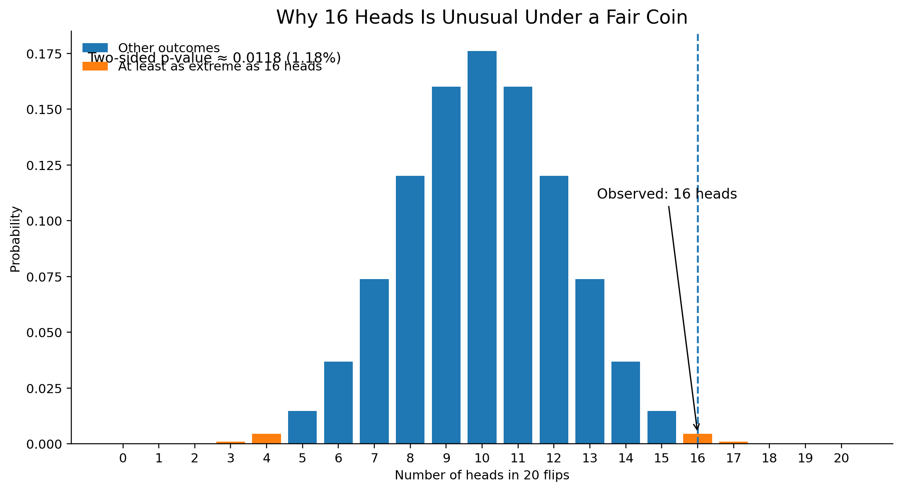

## Why Is a P-Value So Confusing?

Suppose a researcher runs an experiment and reports a p-value of 0.03. What does that number actually mean?

A common interpretation is that there is only a 3% chance that the null hypothesis is true. This sounds reasonable, but it is incorrect.

The p-value is one of the most widely used ideas in statistics, but also one of the most frequently misunderstood. The main reason is that it answers a slightly different question from the one people naturally want to ask.

## A Simple Coin Example

Imagine that someone claims a coin is fair. If the coin is truly fair, the probability of getting heads is

$$
H_0: p = 0.5
$$
Now suppose we flip the coin 20 times and observe 16 heads.

Getting 16 heads out of 20 seems unusual for a fair coin. The p-value gives us a way to measure exactly how unusual this result is.

In this case, the p-value asks:

> If the coin really were fair, what is the probability of observing a result at least as extreme as 16 heads out of 20?

For a two-sided test, this probability is about 0.012, or 1.2%.

So the data would be fairly unusual if the coin were actually fair.

{width="700px"}

## What the P-Value Does — and Does Not — Mean

The easiest way to understand a p-value is to pay attention to the direction of the probability.

A p-value measures

$$
P(\text{data at least as extreme as observed} \mid H_0).
$$

In words, we assume the null hypothesis is true and then ask how surprising the observed data would be.

But this is not the same as

$$
P(H_0 \mid \text{data}),
$$

which would mean the probability that the null hypothesis is true given the data.

This difference is subtle but important. A p-value of 0.03 does **not** mean that there is a 3% chance that the null hypothesis is true. It means that, if the null hypothesis were true, results at least as extreme as the one we observed would occur about 3% of the time.

## A Useful Analogy: Medical Testing

Consider a medical test for a rare disease.

Suppose the test is very accurate, and only 1% of healthy people receive a positive result. In probability notation, this is

$$
P(\text{positive} \mid \text{healthy}) = 0.01.
$$

Now imagine that your test comes back positive.

Can we conclude that there is only a 1% chance that you are healthy?

No.

What we actually want to know is

$$
P(\text{healthy} \mid \text{positive}),
$$

which is a different probability.

To calculate that probability, we would also need other information, such as how common the disease is in the population.

The same logic applies to p-values. A small probability of observing the data under the null hypothesis does not automatically tell us the probability that the null hypothesis itself is true.

## What Does a Small P-Value Tell Us?

Suppose a statistical test gives us

$$
p = 0.03.
$$

This means that, if the null hypothesis were true, results at least as extreme as the one we observed would occur about 3% of the time.

Because such a result would be relatively unusual under the null hypothesis, the data provide evidence against \(H_0\).

Researchers often compare the p-value with a significance level such as

$$
\alpha = 0.05.
$$

If the p-value is smaller than 0.05, the result is often called statistically significant, and researchers may reject the null hypothesis.

Importantly, statistical significance is evidence against the null hypothesis, not a statement about the probability that either hypothesis is true.

## Takeaway

A p-value does not tell us the probability that a hypothesis is true. Instead, it tells us how unusual our data would be if the null hypothesis were true.

The easiest way to remember it is:

> Assume the null hypothesis is true. How surprising is the data?

Once this direction of probability is clear, p-values become much less mysterious.