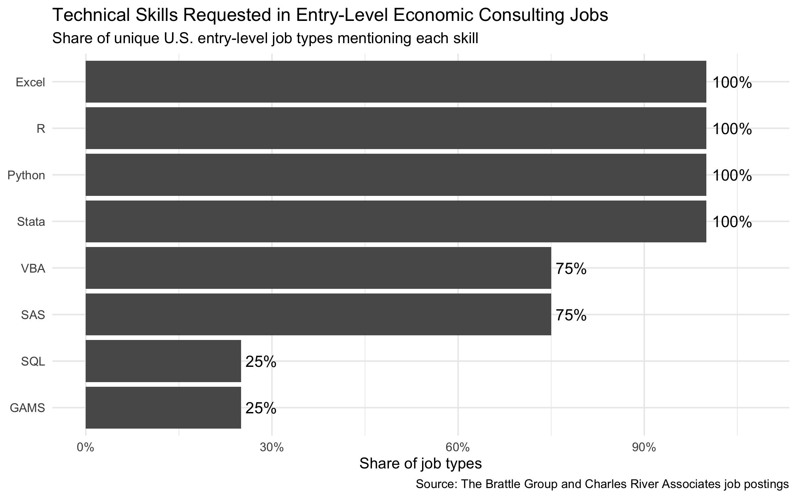
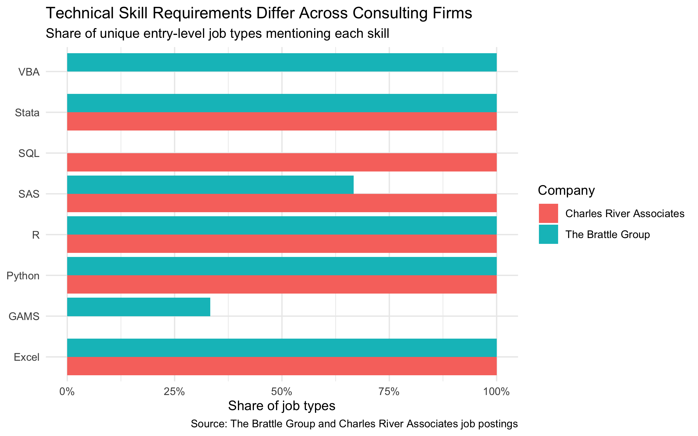

## Introduction

Students interested in economic consulting are often told to learn a wide range of technical tools: Excel, R, Python, Stata, SQL, SAS, and sometimes more specialized software. But if recruiting season is approaching and time is limited, which skills should a student actually prioritize?

To investigate this question, I scraped current entry-level job postings from two economic consulting firms, **The Brattle Group** and **Charles River Associates (CRA)**. My goal was not simply to collect job listings, but to use the postings to identify which technical skills appear consistently across firms and which seem more firm-specific.

## Collecting the Data


I used the `rvest` package in R to collect publicly available job postings from
[The Brattle Group's Greenhouse job board](https://job-boards.greenhouse.io/thebrattlegroup)
and
[Charles River Associates' Greenhouse job board](https://job-boards.greenhouse.io/charlesriverassociates).

I used the `rvest` package in R to collect publicly available job postings from the firms' Greenhouse job boards. I only accessed pages that were publicly visible and did not attempt to bypass logins, CAPTCHAs, or other access restrictions.

For Brattle, I scraped the firm's Greenhouse job-board page to collect individual
job URLs and then visited each posting. For CRA, I used two publicly available
U.S. entry-level economics consulting postings hosted on its Greenhouse site.

```{r}
#| eval: false

library(rvest)
library(dplyr)
library(purrr)

scrape_brattle_job <- function(url) {

  Sys.sleep(1)

  page <- read_html(url)

  tibble(
    job_title = page |> html_element("h1") |> html_text2(),
    job_url = url,
    job_description = page |> html_element("body") |> html_text2()
  )
}
```

I then restricted the sample to U.S. entry-level analyst and internship positions. Because the same Brattle position was sometimes posted separately for multiple cities, I removed duplicate job titles so that one job description would not receive more weight simply because it was offered in several locations.

The final sample contained **eight unique U.S. entry-level job types**: six from Brattle and two from CRA.

## Which Skills Appear Most Often?

I searched each job description for eight technical skills: **Excel, R, Python, Stata, SQL, SAS, VBA, and GAMS**. Each skill was coded as either present or absent in a posting.

{width="800"}

The first result is striking. **Excel, R, Python, and Stata appeared in all eight job types in the sample.** SAS and VBA appeared in six of the eight, while SQL and GAMS appeared in only two.

This suggests that the most useful preparation is not choosing between R and Python. At least in these postings, employers frequently mention both, alongside Stata and Excel. A student preparing for entry-level economic consulting would therefore benefit from being comfortable moving between spreadsheet analysis, statistical software, and general-purpose programming.

## Do Firms Ask for the Same Skills?

The overall percentages hide an important difference between firms.

{width="800"}

Both Brattle and CRA consistently mentioned **Excel, R, Python, and Stata**, suggesting that these four tools form a common technical core in this sample.

The more specialized skills differed substantially. All six Brattle job types mentioned VBA, while neither CRA posting did. GAMS appeared in some Brattle roles but neither CRA role. In contrast, both CRA job types mentioned SQL, while none of the six Brattle job types did. SAS appeared in both firms, although more consistently at CRA.

This distinction matters because a simple industry-wide ranking can hide differences in how individual firms work.

## What Should a Student Learn First?

Based on these postings, I would divide preparation into two stages.

First, prioritize **Excel, R, Python, and Stata**. They were the only four skills mentioned across every job type in the sample, making them the strongest candidates for broadly transferable preparation.

Second, tailor additional skills to the firms being targeted. For example, VBA and GAMS may be especially useful for some Brattle roles, while SQL appears more relevant in the CRA postings examined here.

There are important limitations. This is a small sample of eight unique job types from only two firms, and job postings change over time. The results therefore describe these postings rather than the entire economic consulting industry.

## Takeaway

Web scraping turns scattered job descriptions into structured information that can support a practical decision. In this sample, the clearest pattern is a shared core of **Excel, R, Python, and Stata**, followed by more firm-specific tools such as SAS, VBA, SQL, and GAMS.

For a student with limited preparation time, the evidence from these postings suggests building the common core first and then using current postings from target firms to decide which specialized tools to learn next.